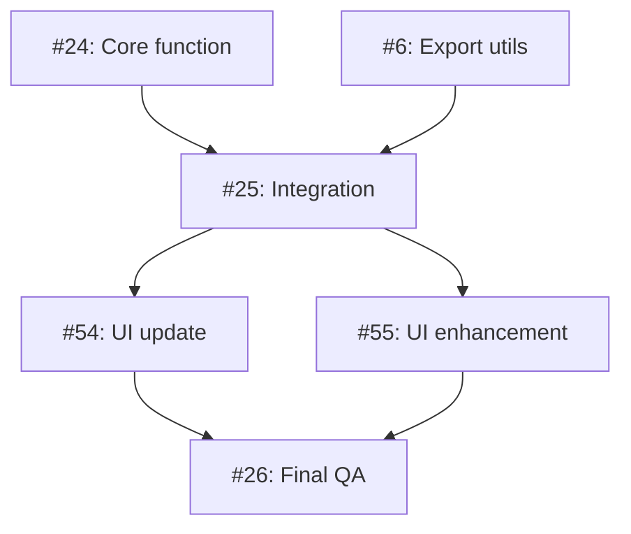

# GitHub Project Structure Template

## Overview
This template provides a reusable structure for organizing multi-repository feature development using GitHub Projects.

---

## Core Principles

### ✅ DO:
1. **Track only issues** on the project board (not PRs)
2. **Order by dependency** (top-to-bottom = what blocks what)
3. **Use clear layer grouping** (Foundation → Integration → UI → QA)
4. **Link PRs in issue descriptions** (not on the board itself)
5. **Use issue templates** for consistency
6. **Add acceptance criteria checklists** to every issue

### ❌ DON'T:
1. **Don't add PRs to project board** (creates duplication)
2. **Don't group by repository** (hides dependencies)
3. **Don't create mega-issues** (hard to track granular progress)
4. **Don't skip validation test cases** (define upfront)

---

## Project Board Structure

### Recommended Fields
Keep the default fields simple:
- **Title** (auto)
- **Status** (Todo, In Progress, Done)
- **Repository** (auto)
- **Labels** (auto)
- **Assignees** (manual)
- **Milestone** (optional, for versioning)

### Issue Ordering Template

```
=== FOUNDATION LAYER (Can work in parallel) ===
1. [repo1] Core calculation/logic function
2. [repo2] Supporting utilities/exports

=== INTEGRATION LAYER (Blocks downstream work) ===
3. [repo1] Integrate into data pipeline/API

=== UI/FEATURE LAYER (User-facing changes) ===
4. [repo3] Update UI component A
5. [repo3] Update UI component B (optional enhancement)

=== FINAL QA (Merge gate) ===
6. [repo1/meta] End-to-end testing and documentation
```

---

## Issue Template Structure

### File: `.github/ISSUE_TEMPLATE/feature-implementation.md`

```markdown
## Overview
[One sentence: What does this issue deliver?]

## Related
- **Project**: [Link to GitHub Project]
- **PR**: [Link to draft PR]
- **Milestone**: [Version number]
- **Dependencies**: [Links to blocking issues]
- **Enables**: [Links to issues this unblocks]

## Scope
[Clear boundaries: what IS and ISN'T included]

## Deliverables

### 1. [Primary Deliverable]
[Detailed description with code examples]

### 2. [Secondary Deliverable]
[Detailed description]

### 3. [Testing Requirements]
[Specific test cases]

## Acceptance Criteria

- [ ] [Measurable outcome 1]
- [ ] [Measurable outcome 2]
- [ ] [Measurable outcome 3]
- [ ] All tests pass
- [ ] `R CMD check` passes (for R packages)
- [ ] Documentation updated

## Validation Test Cases

**Test Case A**: [Description]
- Input: [Specific values]
- Expected: [Specific outcome]

**Test Case B**: [Description]
- Input: [Specific values]
- Expected: [Specific outcome]

## Implementation Notes

- [Technical decision 1]
- [Technical decision 2]
- [Performance targets]
- [Edge cases to handle]

## Future Enhancements (Not in Scope)

- [Optional feature 1]
- [Optional feature 2]
```

---

## Workflow

### 1. **Project Setup**
```bash
# Create GitHub Project
gh project create --owner <org> --title "<Feature Name>" --visibility private

# Add README to project with implementation plan
gh project edit <number> --owner <org> --readme "implementation-plan.md"
```

### 2. **Branch Creation**
```bash
# Create feature branches across all affected repos
cd /path/to/repo1
git checkout -b feature/feature-name
git push -u origin feature/feature-name

cd /path/to/repo2
git checkout -b feature/feature-name
git push -u origin feature/feature-name
```

### 3. **Draft PR Creation**
```bash
# Create draft PRs (one per repo)
cd /path/to/repo1
gh pr create --draft \
  --title "feat: [Feature name]" \
  --body "Implementation for [Feature]. See issues #X, #Y, #Z" \
  --base main \
  --head feature/feature-name
```

### 4. **Issue Creation**
```bash
# Create issues using saved markdown files
gh issue create --title "[Title]" \
  --body-file issue-template.md \
  --repo <org>/<repo>
```

### 5. **Link Issues to Project**
```bash
# Add issues to project (NOT PRs)
gh project item-add <project-number> \
  --owner <org> \
  --url https://github.com/<org>/<repo>/issues/<issue-number>
```

### 6. **Remove PRs from Project** (if accidentally added)
```bash
# Query for item IDs
gh api graphql -f query='
query {
  organization(login: "<org>") {
    projectV2(number: <number>) {
      items(first: 20) {
        nodes {
          id
          type
          content {
            ... on PullRequest { number title }
          }
        }
      }
    }
  }
}'

# Delete PR items
gh api graphql -f query='
mutation {
  deleteProjectV2Item(input: {
    projectId: "<project-id>"
    itemId: "<item-id>"
  }) {
    deletedItemId
  }
}'
```

---

## Dependency Management

### Layered Architecture
Organize issues into clear dependency layers:

```
Layer 1: Foundation (no dependencies)
    ↓
Layer 2: Integration (depends on Layer 1)
    ↓
Layer 3: Features (depends on Layer 2)
    ↓
Layer 4: QA (depends on all previous)
```

### Visualizing Dependencies

**In Issue Descriptions**:
```markdown
## Dependencies
- **Blocks**: #25, #54, #55 (these can't start until this completes)
- **Blocked by**: None (can start immediately)
```

**In Project README**:
```markdown
## Dependency Graph


```

---

## Status Management

### Status Transitions

```
Todo → In Progress → Done
```

**Todo**: Issue created, not started
**In Progress**: Someone actively working (assign yourself)
**Done**: PR merged, issue closed (auto-moves)

### Best Practices

1. **One issue "In Progress" per person** (avoid context switching)
2. **Move to "In Progress" when starting** (don't forget!)
3. **Keep "In Progress" count low** (focus on completion)
4. **Auto-close on PR merge** (use "Closes #X" in PR description)

---

## Label Strategy

### Recommended Labels

**Type labels**:
- `enhancement` - New feature
- `bug` - Bug fix
- `refactor` - Code improvement (no behavior change)
- `documentation` - Docs only

**Priority labels**:
- `priority: critical` - Blocking everything
- `priority: high` - Foundation layer
- `priority: medium` - Feature layer
- `priority: low` - Optional enhancements

**Status labels** (optional, if Status field not enough):
- `blocked` - Waiting on dependency
- `ready-for-review` - PR open, needs review

**Effort labels** (optional):
- `effort: small` - <4 hours
- `effort: medium` - 4-16 hours
- `effort: large` - >16 hours

---

## Milestone Strategy

### When to Use Milestones

✅ **Use milestones for**:
- Multi-issue features (like this project)
- Release versioning (v1.0, v1.1, etc.)
- Sprint planning

❌ **Don't use milestones for**:
- Single issues
- Ad-hoc bug fixes

### Example Milestone Structure

**Milestone**: "Dynamic Benchmark Scoring v1.0"
- Due date: [Target date]
- Description: "Implement percentile-based benchmark scoring across artutils and modGallery"
- Issues: #24, #6, #25, #54, #55, #26

---

## Communication Patterns

### Issue Comments

**Update format**:
```markdown
## Progress Update

**Completed**:
- [x] Created R/benchmarks.R file
- [x] Implemented core calculation logic

**In Progress**:
- [ ] Writing unit tests (50% done)

**Blockers**:
- Waiting on #24 to merge before I can test integration

**ETA**: [Date]
```

### PR References

**In PR description**:
```markdown
## Related Issues
Closes #24
Depends on #6

## Changes
- Created calcArtworkBenchmarks() function
- Added tests for edge cases
- Performance: <50ms on 55-artwork portfolio

## Testing
- [x] Unit tests pass
- [x] Validation artwork A shows expected scores
- [x] Validation artwork B shows expected scores
```

---

## Review Checklist

### Before Creating Issues

- [ ] Implementation plan documented in project README
- [ ] Dependencies mapped out (which issues block which)
- [ ] Validation test cases defined
- [ ] Acceptance criteria are measurable
- [ ] Branch names consistent across repos

### Before Starting Work

- [ ] Read entire issue description
- [ ] Understand acceptance criteria
- [ ] Check dependencies are complete
- [ ] Assign issue to yourself
- [ ] Move to "In Progress"
- [ ] Link to draft PR (if exists)

### Before Marking Complete

- [ ] All acceptance criteria met
- [ ] Tests written and passing
- [ ] Documentation updated
- [ ] PR reviewed and approved
- [ ] No regressions in other features
- [ ] Unblocked issues notified

---

## Template Files Checklist

Store these in `_TASK/` or `.github/` for reuse:

```
project-structure/
├── TEMPLATE-github-project-structure.md  (this file)
├── TEMPLATE-issue-foundation.md          (Layer 1 issues)
├── TEMPLATE-issue-integration.md         (Layer 2 issues)
├── TEMPLATE-issue-feature.md             (Layer 3 issues)
├── TEMPLATE-issue-qa.md                  (Layer 4 issues)
├── TEMPLATE-pr-description.md            (Draft PR template)
└── TEMPLATE-project-readme.md            (Project plan template)
```

---

## Example: This Project Applied

### Project: Gallery Benchmark Scores

**Repositories**: artutils, artbenchmark, modGallery

**Issue Order** (dependency flow):
1. #24 (artutils) - Create calculation function [Foundation]
2. #6 (artbenchmark) - Export percentile util [Foundation]
3. #25 (artutils) - Integrate into getAppdata() [Integration]
4. #54 (modGallery) - Update scoreBox UI [Feature]
5. #55 (modGallery) - Add drill-down modals [Feature]
6. #26 (artutils) - End-to-end testing [QA]

**PRs** (not on board):
- artutils PR #23 (linked in #24, #25, #26)
- modGallery PR #53 (linked in #54, #55)
- artbenchmark PR #5 (linked in #6)

**Outcome**:
- Clean project board showing only 6 issues
- Clear dependency flow from top to bottom
- PRs accessible via issue links
- Reusable structure for next feature

---

## Troubleshooting

### "My PRs are on the project board"
**Solution**: Remove them using the GraphQL mutation above. Only issues should be on the board.

### "I can't tell what's blocking what"
**Solution**: Reorder issues by dependency (Foundation → Integration → Feature → QA). Add "Dependencies" section to each issue.

### "Issues are grouped by repo, not dependency"
**Solution**: Re-order manually. Don't use repository grouping - use dependency grouping.

### "I have too many issues In Progress"
**Solution**: Focus on completing one issue at a time. Move extras back to Todo.

### "My issue is too big"
**Solution**: Break into smaller issues (but not too small - find the right granularity).

---

## Success Metrics

A well-organized project board should have:

✅ **6-12 issues** (not too few, not too many)
✅ **Clear dependency order** (top-to-bottom)
✅ **All issues have acceptance criteria**
✅ **Test cases defined upfront**
✅ **PRs linked but not on board**
✅ **1-3 issues "In Progress" max**
✅ **No orphaned or blocked items**

---

## Next Steps

1. Copy this template to your org's `.github` repo
2. Customize for your workflow
3. Create issue templates in each repo
4. Train team on the structure
5. Use for next multi-repo feature!
