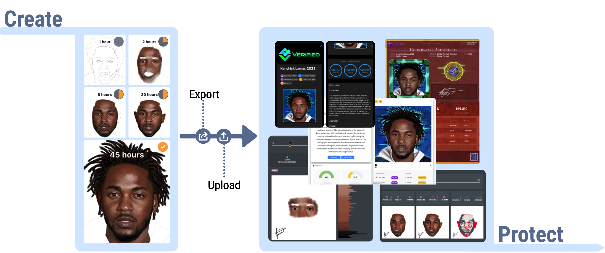

# Artalytics

**Authenticity. Trust. Insight.**

Artalytics is a platform that brings **confidence and transparency to digital art**.
We combine proprietary image analysis with modern web applications to:

* **Authenticate artworks** – verifying originality and creation process.
* **Issue Certificates of Authenticity (COAs)** – blockchain-backed, tamper-evident, and publicly searchable.
* **Showcase collections** – through interactive galleries that let anyone explore verified works.
* **Deliver insights** – offering artists and collectors data-driven perspectives on style, value, and provenance.

---

## 🌐 How It Works

## ✨ Why Artalytics?

* **Trust** – A single source of truth for digital art authenticity.
* **Security** – Certificates and media are safeguarded with cloud-based storage and CDN distribution.
* **Engagement** – Time-lapse replays and analytic insights deepen appreciation of the creative process.
* **Future-Proof** – Built with scalability, blockchain anchoring, and AI integrations in mind.

## 📍 Explore More

* To learn more about artalytics, visit our [**website**](https://artalytics.app).
* Visit [**Certificates.Art**](https://certificates.art) to view live Certificates of Authenticity.
* For video explanations and demos, check out our [**YouTube channel**](https://www.youtube.com/@artalytics).
* View our [**investor materials**](https://investors.artalytics.info) for a deeper look at the vision and technology.

---

>💡 *Artalytics is currently in its pre-seed stage, building the foundation for a secure, scalable future of digital art authenticity and analytics.*

